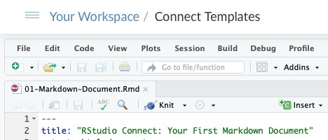
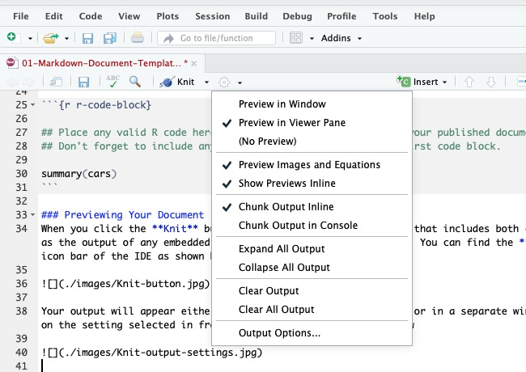
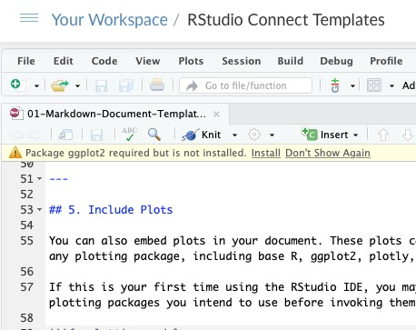

```{r setup, include=FALSE}
knitr::opts_chunk$set(echo = TRUE)
```

---

The best way to get to know RStudio Connect is to use it. This template publishes a report that contains text, a table, and a couple graphics. 

---

## 1. Begin With The RStudio Desktop Integrated Development Environment (IDE) on RStudio.cloud
We provisioned this template on your Connect server as a static document, but it is also available for you to edit and publish on RStudio.cloud. Simply open this RStudio.cloud project, and save it in your own space, and you'll have access to all the RStudio Connect templates. The rstudio.cloud project is here:

https://rstudio.cloud/project/129247

---

## 2. Write Markdown
This template is an R Markdown document. Markdown is a simple formatting syntax for authoring HTML, PDF, and MS Word documents. For more details on using R Markdown see <http://rmarkdown.rstudio.com>.

---

## 3. Include R Code In Your Document
You can embed an R code chunk as shown below. You can place any valid R code here and its output will be included in your published R Markdown document.

```{r r-code-block}

## Place any valid R code here and its output will be shown in your published document
## Don't forget to include any libraries you may need in your first code block.

summary(cars)
```

---

## 4. Knit Your Document
When you click the **Knit** button a document will be generated that includes both content as well as the output of any embedded R code chunks within the document. You can find the **Knit** in the icon bar of the IDE as shown below.



Your output will appear either in the RStudio IDE *Viewer* pane or in a separate window, depending on the setting selected in from the settings menu as shown below



---

## 5. Include A Basic Plot

You can also embed plots in your document. These plots can be ones made with any plotting package, including base R, ggplot2, plotly, or others.

If this is your first time using the RStudio IDE, you may need to install any plotting packages you intend to use before invoking them. 

```{r plotting-code}
plot(pressure)
```

---

## 6. Add A Package And Exclude Code You Don't Want Shown

For this final plot, we'll use ggplot2 to plot the same pressure chart. If this is the first time you've used the RStudio IDE, the ggplot2 package won't be installed, resulting in the following dialog in the top left of your screen:



Simply click on the word `Install` to install ggplot2 and its dependencies.

If you didn't want the R code that generates the plot to appear in your final document, you add `echo = FALSE` to the code chunk that generates the plot, 
and then knit your document again. You should see the same pressure graph again, but this time against the default gray ggplot2 background.

```{r plotting-code without echo, echo=FALSE}

## If this is the first time you've used the RStudio IDE, you may need 
## to install the ggplot2 package to use it as a library. 

# install.packages("ggplot2")
library(ggplot2)

ggplot(data=pressure, aes(x=temperature, y=pressure)) + geom_point()
```

You've now built out your first RStudio Connect R Markdown document. You can continue to add code and text chunks to publish any type of analysis you wish. You can also knit PDF and Microsoft Word versions of this document simply by selecting the appropriate option from the `Knit` menu.

Other templates in this RStudio project will allow you to create dynamic and interactive documents.


